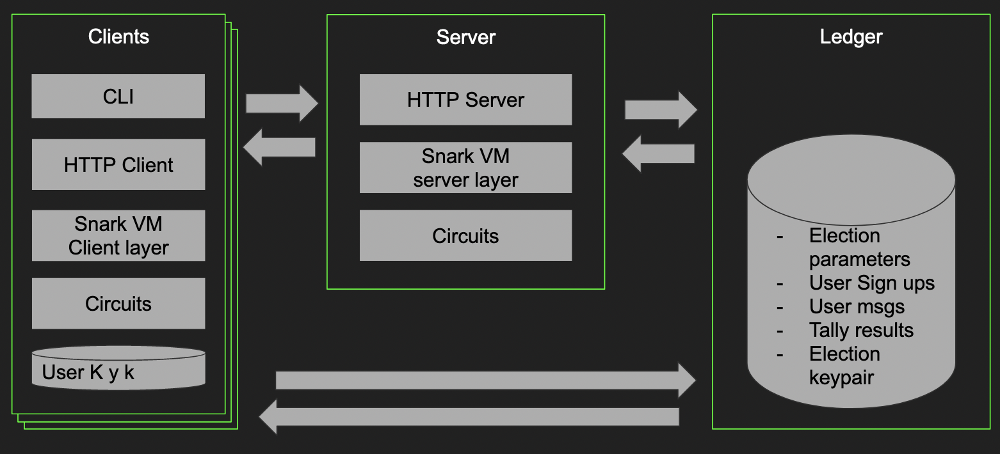

# Aleo Voting System

## How to use

### Alternative 1: Nix

To use the project you need to have [nix](https://nix.dev/tutorials/install-nix) installed.

To enter nix-shell, use:

`make nix-shell`

If it's the first time using this app run:

`make init`

To start the server and the dashboard run:

`make ops`

`make run_server`

`make run_dashboard`

Make ops will start a redis DB that can be shutdown with:

`make stop_ops`

### How to perform a demo election

1. To create and electrion with a example whitelist run:

`make create_test_tally`

2. to send a vote for option 1, 2 o r 3 you can run any of these commands:

`make send_test_vote_1`

`make send_test_vote_2`

`make send_test_vote_3`

3. lastly, when the votes are visible on the aleo explorer, you can run the tally:
`make start_tally`

Now the result should be visible on the dashboard.

### Alternative 2: Docker

You can also run the server with docker

`make build_images`

`make run_docker`

## Overview

Electronic voting system application on Aleo that implements MACI (Minimal anti-collusion infrastructure) with a simple CLI and a server.

## The Problem

Electronic voting is a controversial topic that awakens different opinions regarding its implementation and vulnerability. While it is currently being used by several organizations and governments, those that criticize it claim that electronic voting is not secure since it compromises the anonymity of the voter and the safety of the election. 

If the information of each vote becomes public, or if the voter can prove he has voted for one party, it’s easy for the voters to collude. An actor that wants to manipulate the election, may offer bribes or find how to incentivize or penalize the voters in exchange for them acting as he wants.

For this reason, it’s of utter importance that there’s no easy mechanism to verify how someone has voted. And even more, the existence of mechanisms capable of nullifying and changing votes without anybody knowing, in order to render any kind of proof useless. 
 
We believe that an electronic voting system developed on Aleo, which uses zero knowledge cryptography to achieve both privacy and programmability, secures the voter’s anonymity and the election’s outcome.

## Our Approach

As it says on [aleo.org](https://aleo.org): “Zero knowledge cryptography and zero knowledge proofs allow third parties to verify the truth of a piece of information without us needing to reveal it directly”. This is the very essence of a secret ballot system and the backbone paradigm behind Aleo. Aleo provides both the privacy and programmability needed to develop a private but still dynamic application. With this in mind we will develop an electronic voting system application using Leo, Aleo’s programming language, and Rust when required. 

## Why privacy?

Privacy is the backbone of a secret ballot system and it is why Aleo is the right technology for this project. Ethereum provides limited privacy while Aleo excels at providing privacy for the user and in our use case, the voter.

## Why implement MACI specifically?

"Minimal Anti-Collusion Infrastructure (MACI) is a set of smart contracts and zero-knowledge circuits upon which developers can build collusion-resistant applications, such as voting systems or quadratic funding platforms. MACI grants resistance to collusion for decentralized applications and it is important because crypto communities are increasingly adopting Decentralised Autonomous Organisations (DAOs) which govern through token voting"[*](https://medium.com/privacy-scaling-explorations/release-announcement-maci-1-0-c032bddd2157). MACI has a use for several other applications such as gaming, gambling and finance.

# Aleo MACI technical doc

This system is divided in 3 main components: a [client](../client), a [server](../server), and a [shared](../libs) library.

## Architecture Diagram

## Sequence Diagrams

You can find detailed sequence diagrams for every key operation [here](diagrams/aleo_maci_sequence_diagram.pdf).

## Components Overview

### The Client

The [client](client) is the program that run locally for each voter, it's responsible of:
- Ask the server to create an election
- Signing up an user to an election
- Sending user messages to the election
- Ask the server to start the tally
- Verifies that the users votes were properly counted after the tally ends.

### The Server

The [server](server) is a rust written http server implemented with the [warp framework](https://github.com/seanmonstar/warp) and makes use of a [Rocksdb](https://github.com/facebook/rocksdb/) instance to store transactions_ids.

The server is responsible of:
- Creating and election
- Do the tally
- Storing every needed transaction_id to the db.

### Shared Library

The [shared library](libs) is a rust lib that contains all the necessary code in order to make the client and server communication possible with ease.

It also contains common modules to interact with the blockchain from the client or the server, and shared circuits for basic operations, like storing data. 

# Maci Flow and Encryption Overview

This is an overview of the flow of the program, with a focus on the encryption part of it. Additional processes to handle validations and commitments, and structures like merkle tree to optimize the process, may be added.

Note this also uses a two step process to tally the vote, which is better to understand how the keys are used, but may not reflect the final implementation.

## Voter process

1. Registers, submitting a public key on the blockchain.

2. Sends a message to vote or change his public key

A message always has following parts:
    - An encrypted user public key
    - An encrypted vote (can be a nil)
    - A non encrypted user public key.

For the encryption, the ECDH protocol is used. In it, both parties uses the same shared key to encrypt and decrypt messages. This shared key, in the case of the voter, is made by multiplying the operator public key with the voter private key. The operator public key, is always avaible, and can be found in the blockchain by the client.

Having the shared key, the message can be encrypted with any symetric key cipher. For efficiency, Poseidon, a snark friendly  one is used. Others like mimc could be used too.

## Tallier process

    
### Two step solution:

Once again, here we focus on the encryption part, so a lot of details are ignored (Merkle proofs, signature validation, additional commitments needed, etc)

#### Update state

- Generate an off chain copy of the signed up users and their keys
- For each message (in a circuit for proof submitting AND offchain to get the values)
    - If the non encrypted public key is found in the local state/circuit state
        -  Make a shared key with the operator private key, and the non encrypted key
        -  Decrypt the message
        -  Update the local state/circuit state with the decrypted public key
    - Set a new public key for the user in the offchain copy to the updated one 
- Publish the merkle root of the updated votes along with the ZKP (circuit output).

Note that in this example, we are processing all messages in one go.

This same process can be applied in batches, if the we want to have checkpoints from where to continue. To do so, we need to generate intermediate merkle roots in the circuit, and add the batched merkle tree to the state tree. 

#### Tally the vote

- Using the merkle root and the updated state as input, verify they match
- For each message, having the updated state as message (in a circuit)
    - If the public key on the message matches one in the updated state tree, decrypt by making a shared key with the operator private key, and tally the vote, else skip.
- Publish a commitment of the results as the circuit output, and the results as plain data. 

Note this can also be done in batches

## Verifying the tally

Any observer can verify the data of the results matches the comitment, and doing so, know it's the result of an operator executing the circuit.

Having the list of used votes, any observer can verify the merkle root of it matches the one that was used as input on the circuit. 

Having it's own vote, any voter can see his vote was used to make the merkle root that was used on the circuit.

## Annex 1: Deceiving a briber

One of the key aspects of MACI is to not let a Briber and a Voter collude, by not letting them being able to trust each other. For this sake, the following subterfuge techniques can be used:

### Vote change

- The user can always change his vote, so not seeing the messages, the briber can't pay before the voting ends, and after it ends, the user can't be sure he will get paid. 

- Note this technique may be bypassed if there is a smart contract involved, to solve the issue both parties can't time the payment.

### Fake votes 

- The user may use a non valid public key to encrypt the votes, and even give his private key, and it won't matter, since the vote will be discarded. 

- To disrupt even further programs that requires a clean flow of votes, any user or machine may publish fake votes, saying the message belongs to a public key that it's not of theirs.

### The shared key case

The most troublesome scenario is a user sharing it's initial shared key. In this case, a briber is able to see the user's messages. 

To deceive the briber in this case, the user may publish a message with his true Public Key, but encrypt it with a non valid pair of keys.

Let's call the legitimate pair of keys (k, K), and the fake ones (fk,fK)

Let's call the operator pair of keys (ok, oK) 

Let's call the legitimate shared key s = k\*oK and the fake shared key fs = fk\*oK

The voter will then submit a message, exposing the public key K, and encrypting the vote with fs.

A briber can then decrypt the message with fs, but can't know if that fs comes from K or fK. 

When the operator decrypts, he will use the shared key ok\*K that doesn't match the one with the encrypted votes, the message won't be properly formatted, and so it will be discarded.
